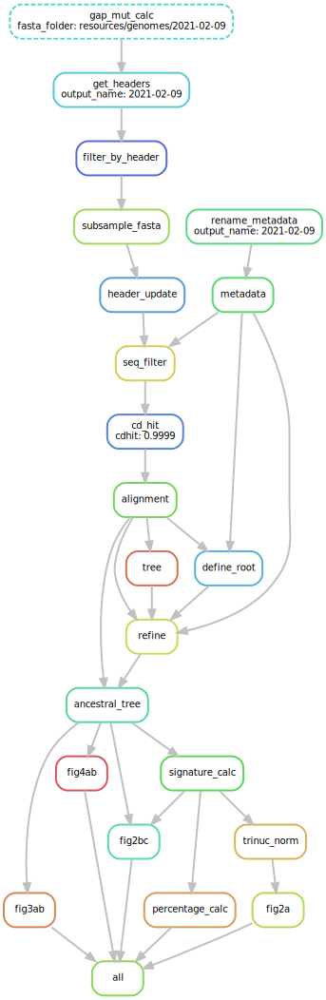

# SARS-CoV-2 Mutation Profile

This repository contains the codes used for processing the data and producing the figures in the paper: [The mutation profile of SARS-CoV-2 is primarily shaped by the host antiviral defense](https://www.biorxiv.org/content/10.1101/2021.02.02.429486v1)

## Installation

- This workflow is prepared using [Snakemake](https://snakemake.readthedocs.io/en/stable/) workflow management system and [conda](https://docs.conda.io/en/latest/)

- To run the workflow, you should have conda installed for environment management. All the other packages including Snakemake and their dependencies can be obtained automatically through environments prepared for each step of the workflow. You can follow the installation steps from [the link](https://docs.conda.io/projects/conda/en/latest/user-guide/install/download.html).

- Initially, you should clone the repository and navigate into the directory: 

    ```
    git clone https://github.com/CompGenomeLab/SARS-CoV-2_Mutational_Profile.git
        
    cd SARS-CoV-2_Mutational_Profile/
    ```


- Next, you should create a conda environment with the defined packages. We propose 2 way to create the environment:

    - One is installing [mamba](https://mamba.readthedocs.io/en/latest/) and creating the environment using mamba:

        ```
        conda install -c conda-forge mamba

        mamba create -c bioconda -c conda-forge -c r -n covid19 snakemake python=3.8

        conda activate covid19

        mamba install -c conda-forge -c bioconda augur=9.0.0
        ```

    - Or the environment can be directly created from our environment file:

        ```
        conda env create -f workflow/envs/env.yaml

        conda activate covid19
        ```

| Note: The steps described here apply to the Linux operating system. There may be slight differences in codes between operating systems. |
| --- |

## Directory Structure

This workflow is prepared according to the [structure](https://snakemake.readthedocs.io/en/stable/snakefiles/deployment.html) recommended by Snakemake: 

- `config/`: contains the configuration file.
- `resources/`: contains the input files. Although some of the files are provided in the repository, the raw genomes, their pre-computed multiple sequence alignment, and their metadata file, which are retrieved from [GISAID](https://www.gisaid.org/) database [1] are not provided. This 3 data must be obtained and stored in the `resources/` directory before running the workflow and their names and directories must be properly added to the configuration file.     
- `results/`: contains the generated files and figures. Inside this directory, we provided a folder called `processed/`, which contains the generated results of the paper.
- `logs/`: contains the log files of each step. This folder will automatically appear when you run the workflow.
- `workflow/`: contains the main `Snakefile`, `envs/` where the environments are stored, `rules/` where the Snakemake rules are stored, and `scripts/` where the scripts used inside the rules are stored. 

## Configuration file

Before running the workflow, you should edit the [configuration file](https://github.com/CompGenomeLab/SARS-CoV-2_Mutational_Profile/blob/master/config/config.yaml).  

- `output_name`: all the outputs will be stored in `results/` directory inside this folder. In addition, the <output_name> will be added to the names of the generated files.
- `fasta_file`: name of the input fasta file. Ex: `"2021-02-09"`
- `msa`: name of the pre-computed multiple sequence alignment.
- `fasta_folder`: directory where fasta file and pre-computed multiple sequence alignment are stored. Ex: `"resources/genomes/2021-02-09"`.
- `info_file`: name of the input metadata file.
- `info folder`: directory where input metadata file is stored.
- `subset`: # of remaining sequences after subsampling step.
- `time_window`: range of genome dates that will be used in the analyses (Any genome with a date value that is out of this range will be discarded from the analyses.). Ex: `"2019-01-01:2022-01-01"`
- `redo`: repeating the building the tree (true or false). It is recommeded to set it as true in case a corrupted tree file is produced and needed to be reproduced. 
- `reference_fa`: name of the reference fasta file. The directory is `resources/reference_genome/`. If you want to change the reference, you should store it in the given directory and set the name of the file here.
- `reference_gff`: name of the reference gff file. The directory is `resources/reference_genome/`. If you want to change the reference, you should store it in the given directory and set the name of the file here.   
- `cdhit`: sequence identity treshold set for the [cd-hit](http://weizhongli-lab.org/cd-hit/) algorithm [2]. You can provide multiple tresholds in a list, which will result in generation of downstream outputs for each treshold value of cd-hit, seperately. 

## Usage

After adjusting the configuration file, you can run the workflow from `SARS-CoV-2_Mutational_Profile/` directory:

```
snakemake -pr --use-conda --cores 64 --debug-dag
```

## DAG file



Figure 1: A directed acyclic graph (DAG) of the analysis.

## References

[1] Shu, Y., & McCauley, J. (2017). GISAID: Global initiative on sharing all influenza data -from vision to reality. Euro Surveill, 22(13). doi:10.2807/1560-7917.ES.2017.22.13.30494

[2] Fu, L., Niu, B., Zhu, Z., Wu, S., & Li, W. (2012). CD-HIT: accelerated for clustering the next-generation sequencing data. Bioinformatics, 28(23), 3150–3152. doi:10.1093/bioinformatics/bts565